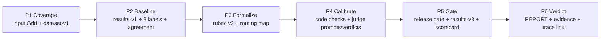

# Hồ sơ bài nộp cá nhân — Huỳnh Thị Hải Châu

## Thông tin cá nhân và nhóm

- Họ tên: **Huỳnh Thị Hải Châu**.
- MHV/MSSV: **2A202601912**.
- Repo cá nhân khi nộp: `Track1_Day21_2A202601912_HuynhThiHaiChau`.
- Nhóm: **VLearn AI Tutor — 3 thành viên**.
- Thành viên: Huỳnh Thị Hải Châu — `2A202601912`; Phạm Hải Yến —
  `2A202601152`; Tạ Thị Thu Huyền — `2A202601782`.
- Eval Pack dùng chung: [deliverables/REPORT.md](../../deliverables/REPORT.md) và
  [deliverables/evidence/](../../deliverables/evidence/README.md).

## Phân công cân bằng của nhóm

| Thành viên | Workstream sở hữu chính | Phần chung bắt buộc |
|---|---|---|
| **Huỳnh Thị Hải Châu** | Coverage/dataset và deterministic code gate | Chấm độc lập 30 rows, review chéo và chốt verdict |
| **Tạ Thị Thu Huyền** | Human baseline, rubric semantic và judge calibration | Chấm độc lập 30 rows, review chéo và chốt verdict |
| **Phạm Hải Yến** | Routing, release gate, scorecard và final report | Chấm độc lập 30 rows, review chéo và chốt verdict |

Ba workstream có cùng trách nhiệm đầu vào–đầu ra–quyết định. Mỗi người đều có raw
evidence riêng, một lane đánh giá chính và phần review chéo.

## Sơ đồ sáu phase và artifact

| Phase | Đầu vào | Đầu ra và artifact | Quyết định chính |
|---|---|---|---|
| 1. Coverage | Bài toán VLearn, corpus và rủi ro người dùng | [PHASE-1.md](../../deliverables/PHASE-1.md), [dataset-v1.jsonl](../../deliverables/evidence/dataset-v1.jsonl) | Dùng bốn dimension làm thay đổi behavior; giữ risk riêng; ghi rõ 30/30 input là synthetic-reviewed |
| 2. Human baseline | Dataset v1 và output Tutor | [results-v1.jsonl](../../deliverables/evidence/results-v1.jsonl), ba file label, [agreement-v1.txt](../../deliverables/evidence/agreement-v1.txt), [labels.csv](../../deliverables/evidence/labels.csv) | Chấm độc lập trước thảo luận; agreement 29/30 = 96%; gold 10 pass/20 fail |
| 3. Formalize & route | Disagreement và failure pattern | Rubric v2 và Routing Map trong [REPORT.md](../../deliverables/REPORT.md) | Mọi tiêu chí là blocker; code → LLM assist → human, expert chỉ escalation |
| 4. Scale & calibrate | Gold labels, rubric và baseline results | [code-checks-v1.txt](../../deliverables/evidence/code-checks-v1.txt), judge prompt/verdict và calibration trong [evidence](../../deliverables/evidence/README.md) | Citation deterministic giao code; judge semantic chỉ assist vì Groundedness chạm trần 86% |
| 5. Gate & scorecard | Threshold đóng băng và candidate v3 | [release-gate-v1.md](../../deliverables/evidence/release-gate-v1.md), [results-v3.jsonl](../../deliverables/evidence/results-v3.jsonl), [candidate-v3-adjudication.csv](../../deliverables/evidence/candidate-v3-adjudication.csv), [scorecard-v3.md](../../deliverables/evidence/scorecard-v3.md) | Không chọn snapshot đẹp hơn; báo cáo đúng v3 là regression run |
| 6. Verdict | Scorecard, slices, regression và trace | Mục 6–7 của [REPORT.md](../../deliverables/REPORT.md), [braintrust-link.md](../../deliverables/evidence/braintrust-link.md) | **HOLD**, không cho overall hoặc SLA che blocker quality/scope |

## Đóng góp của tôi

Tôi phụ trách workstream **Coverage + deterministic code gate**:

1. Dẫn dắt Phase 1: chuyển yêu cầu Tutor thành bốn dimension `question_type`,
   `corpus_coverage`, `clarity`, `real_world_constraint`; rà coverage, risk và
   `expected_behavior` của 30 scenarios.
2. Tạo nhãn độc lập cho đủ 30 rows tại
   [labels-hai-chau.csv](../../labels-hai-chau.csv), ghi note theo blocker.
3. Phụ trách lane code: schema, citation tồn tại, quote nguyên văn, follow-up
   structure và scope/source/tool contract; đối chiếu ID fail với corpus.
4. Kiểm tra provenance: không ghi đè version, không đưa `verdicts.jsonl` lỗi/429 ở
   root vào evidence, xác nhận v3 persist `tool_calls/steps` cho 30/30 rows.
5. Review chéo scorecard và xác nhận code gate v3 là 19 green/11 quote fail trước khi
   judge được chạy.

## Verdict của nhóm và vì sao

Nhóm chốt **HOLD / CHƯA SHIP**. Candidate v3 đạt operational gate nhưng chỉ có
**7/30 overall pass**; quote verbatim **19/30**; groundedness **15/30**; follow-up
semantic **26/30**; critical scope **4/6**. Các quality/hard gate này đã khóa trước
khi xem candidate, nên không đủ điều kiện `SHIP WITH CONDITIONS`.

## Điều tôi sẽ mang về áp dụng cho dự án thật

Tôi sẽ bắt đầu eval bằng coverage grid gắn với behavior và failure cost, thay vì để
model tự sinh một danh sách test “trông đa dạng”. Schema, source ID và quote span sẽ
được triển khai thành code gate chạy trước LLM judge. Tôi cũng sẽ version hóa
dataset/results/check output ngay sau mỗi run để quyết định release truy ngược được
về raw evidence.

AI Support Log cá nhân: [ai-support-log.md](ai-support-log.md).
